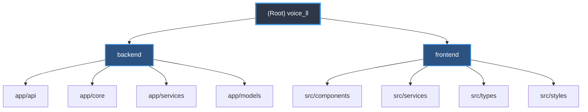

# Voice Cloning Web Application - Architecture Documentation

> Last Updated: 2026-02-06 09:27:24 | Generated by init-architect

## Changelog

### 2026-02-06 09:27:24 - Architecture Documentation Generated
- Complete project scan and documentation generation
- Added module structure diagram with clickable links
- Created module-level documentation for backend and frontend
- Documented all entry points, APIs, and integration patterns
- Coverage: 38 files scanned across 2 main modules

---

## Project Vision

A production-ready voice cloning web application that enables users to synthesize speech with custom voices using AI-powered voice cloning technology. The system provides a modern, user-friendly interface for uploading reference audio and generating high-quality synthesized speech through GPT-SoVITS integration.

**Target Audience**: Small teams, internal deployments, voice synthesis applications
**Deployment Model**: Self-hosted with Docker support
**Security Model**: API key authentication with CORS protection

---

## Architecture Overview

This is a **full-stack voice cloning application** with clear separation of concerns:

```
┌─────────────────┐      HTTP/REST      ┌──────────────────┐      HTTP API      ┌──────────────────┐
│  React Frontend │ ◄──────────────────► │  FastAPI Backend │ ◄─────────────────► │  GPT-SoVITS API  │
│   (Port 3000)   │                      │   (Port 8000)    │                     │   (Port 9880)    │
│                 │                      │                  │                     │                  │
│ - UI Components │                      │ - REST API       │                     │ - Voice Cloning  │
│ - State Mgmt    │                      │ - Auth Layer     │                     │ - TTS Engine     │
│ - API Client    │                      │ - Proxy Service  │                     │ - Model Serving  │
└─────────────────┘                      └──────────────────┘                     └──────────────────┘
```

**Technology Stack**:
- **Frontend**: React 18 + TypeScript + Vite
- **Backend**: FastAPI (Python 3.10+) + Pydantic + httpx
- **External Service**: GPT-SoVITS (voice cloning engine)
- **Deployment**: Docker Compose, Conda environments

---

## Module Structure Diagram



---

## Module Index

| Module | Path | Language | Purpose | Entry Point | Tests |
|--------|------|----------|---------|-------------|-------|
| **Backend API** | `backend/` | Python | FastAPI REST API, GPT-SoVITS proxy | `app/main.py` | pytest (configured) |
| **Frontend UI** | `frontend/` | TypeScript | React SPA, voice cloning interface | `src/main.tsx` | None |

---

## Running and Development

### Prerequisites

- **Python**: 3.10+ (Conda recommended at `D:\conda\python.exe`)
- **Node.js**: 16+ with npm
- **GPT-SoVITS**: Running on localhost:9880
- **OS**: Windows (win32) - GBK encoding, use ASCII output only

### Quick Start (Full Stack)

**Terminal 1 - GPT-SoVITS**:
```bash
cd path/to/GPT-SoVITS
python api.py  # Starts on port 9880
```

**Terminal 2 - Backend**:
```bash
cd D:\pythonproject\voice_ll\backend
conda activate voice_api
uvicorn app.main:app --reload --port 8000
```

**Terminal 3 - Frontend**:
```bash
cd D:\pythonproject\voice_ll\frontend
npm run dev  # Starts on port 3000
```

**Access**:
- Frontend: http://localhost:3000
- Backend API Docs: http://localhost:8000/docs
- Health Check: http://localhost:8000/health

### Initial Setup

**Backend Setup**:
```bash
cd backend
conda create -n voice_api python=3.10
conda activate voice_api
pip install -r requirements.txt
copy .env.example .env
# Edit .env: Set API_KEY and SOVITS_BASE_URL
python -c "import secrets; print(secrets.token_urlsafe(32))"  # Generate API key
```

**Frontend Setup**:
```bash
cd frontend
npm install
```

### Development Commands

| Task | Backend | Frontend |
|------|---------|----------|
| **Dev Server** | `uvicorn app.main:app --reload` | `npm run dev` |
| **Build** | N/A | `npm run build` |
| **Test** | `pytest` (configured) | N/A |
| **Lint** | `flake8`, `mypy` | `npm run lint` |
| **Format** | `black .` | N/A |

---

## Testing Strategy

### Backend Testing
- **Framework**: pytest + pytest-asyncio
- **Coverage**: API endpoints, service layer, authentication
- **Test Commands**:
  ```bash
  pytest                    # Run all tests
  pytest -v                 # Verbose output
  pytest --cov=app          # With coverage
  ```

### Frontend Testing
- **Status**: No test framework configured yet
- **Recommendation**: Add Vitest + React Testing Library
- **Manual Testing**:
  1. Health indicator (green = backend online)
  2. File upload (drag-and-drop, validation)
  3. Voice synthesis workflow
  4. Audio playback and download

### Integration Testing
```bash
# Health check
curl http://localhost:8000/health

# Voice synthesis (replace API key)
curl -X POST "http://localhost:8000/api/v1/voice/synthesize" \
  -H "X-API-Key: your-api-key" \
  -F "text=Test synthesis" \
  -F "reference_audio=@test.wav" \
  -F "language=en" \
  --output test_output.wav
```

---

## Coding Standards

### Backend (Python)
- **Style**: PEP 8, enforced by `black` and `flake8`
- **Type Hints**: Required, checked by `mypy`
- **Async**: Use `async/await` for I/O operations
- **Error Handling**: Structured exceptions with HTTPException
- **Logging**: Use Python logging module, INFO level default
- **Validation**: Pydantic models for all request/response schemas

### Frontend (TypeScript)
- **Style**: ESLint + TypeScript strict mode
- **Components**: Functional components with hooks
- **State**: Local state with useState, no global state manager
- **Types**: Explicit types in `src/types/index.ts`
- **API Calls**: Centralized in `src/services/api.ts`
- **Error Handling**: Try-catch with user-friendly messages

### General Principles
- **No hardcoded secrets**: Use environment variables
- **ASCII output only**: Windows GBK encoding limitation
- **Path handling**: Use forward slashes or `pathlib.Path`
- **CORS**: Explicit origin whitelist, no wildcards in production
- **File validation**: Size limits (10MB backend, 50MB mentioned in docs) and format checks

---

## AI Usage Guidelines

### When Working with This Codebase

**DO**:
- Read module-level `CLAUDE.md` files for detailed context
- Check existing patterns before implementing new features
- Use type hints and validation schemas
- Test API endpoints with curl or Swagger UI
- Verify GPT-SoVITS is running before debugging synthesis issues
- Use ASCII characters only in console output (Windows GBK)

**DON'T**:
- Commit `.env` files or API keys
- Use wildcard CORS origins
- Skip file upload validation
- Assume GPT-SoVITS API contract without checking
- Use Unicode characters in terminal output

### Common Tasks

**Add New API Endpoint**:
1. Define Pydantic schemas in `backend/app/models/schemas.py`
2. Create route handler in `backend/app/api/routes/`
3. Add authentication with `Depends(verify_api_key)`
4. Update frontend API client in `src/services/api.ts`
5. Test with Swagger UI at `/docs`

**Add New Frontend Component**:
1. Create component in `src/components/`
2. Define prop types in `src/types/index.ts`
3. Import and use in parent component
4. Add styles in `src/styles/`
5. Test in browser with hot reload

**Debug Synthesis Issues**:
1. Check GPT-SoVITS health: `curl http://localhost:9880/health`
2. Verify backend logs for errors
3. Check browser console for frontend errors
4. Validate file format and size
5. Test with curl to isolate frontend vs backend issues

---

## Environment-Specific Notes

### Windows (Current Environment)
- **Console Encoding**: GBK - use ASCII only in output
- **Python**: Conda at `D:\conda\python.exe`
- **Conda Envs**: `D:\conda\envs\`
- **Path Separators**: Use forward slashes or `pathlib.Path`
- **Line Endings**: Git should handle CRLF/LF conversion

### Docker Deployment
- **Compose File**: `docker-compose.yml` provided
- **Services**: backend, frontend, sovits
- **Volumes**: Code mounted for development
- **Ports**: 8000 (backend), 3000 (frontend), 9880 (sovits)
- **Note**: GPT-SoVITS Docker image must be built separately

---

## Key Integration Points

### Frontend → Backend
- **Base URL**: `/api` (proxied via Vite to `http://localhost:8000`)
- **Authentication**: `X-API-Key` header (configured in `api.ts`)
- **Endpoints**:
  - `GET /health` - Backend health check
  - `POST /api/v1/voice/synthesize` - Voice cloning (multipart/form-data)
- **Response**: Binary audio data (WAV) or JSON error

### Backend → GPT-SoVITS
- **Base URL**: `http://localhost:9880` (configurable via `SOVITS_BASE_URL`)
- **Client**: `app/services/sovits_client.py` (httpx async)
- **Endpoints**:
  - `GET /health` - Service health check
  - `POST /synthesize` - Voice synthesis
- **Timeout**: 300 seconds (5 minutes)
- **Request**: Multipart form with reference_audio, text, language, speed, temperature
- **Response**: Audio file (WAV format)

---

## Security Considerations

1. **API Key Authentication**: Single shared key (basic security model)
2. **CORS**: Whitelist origins in `ALLOWED_ORIGINS` env var
3. **File Upload**: 10MB limit, format validation (WAV/MP3/FLAC/OGG)
4. **Rate Limiting**: Not implemented - consider adding for production
5. **HTTPS**: Not configured - use reverse proxy (nginx/caddy) in production
6. **Input Validation**: Pydantic schemas enforce constraints
7. **Error Messages**: Generic messages to avoid information leakage

---

## Performance Notes

- **Synthesis Latency**: 5-30 seconds depending on text length and hardware
- **Timeout**: Backend configured for 300s, frontend for 120s
- **File Upload**: Max 10MB (backend config), streaming not implemented
- **Concurrent Requests**: GPT-SoVITS may have limited capacity
- **Memory**: Blob URLs created for audio, cleaned up on unmount

---

## Troubleshooting Quick Reference

| Issue | Solution |
|-------|----------|
| Backend won't start | Check conda env activated, `.env` file exists |
| CORS errors | Add frontend URL to `ALLOWED_ORIGINS` in `.env` |
| Unauthorized errors | Verify API key matches in backend `.env` and frontend `api.ts` |
| Synthesis timeout | Check GPT-SoVITS is running, increase timeout if needed |
| File upload fails | Check file size (<10MB) and format (WAV/MP3/FLAC/OGG) |
| Audio won't play | Try different browser, check console for codec errors |
| Unicode errors | Use ASCII only in console output (Windows GBK) |

---

## Related Documentation

- **Backend Module**: [backend/CLAUDE.md](./backend/CLAUDE.md)
- **Frontend Module**: [frontend/CLAUDE.md](./frontend/CLAUDE.md)
- **Project README**: [README.md](./README.md)
- **Setup Guide**: [SETUP.md](./SETUP.md)
- **API Documentation**: http://localhost:8000/docs (when running)
